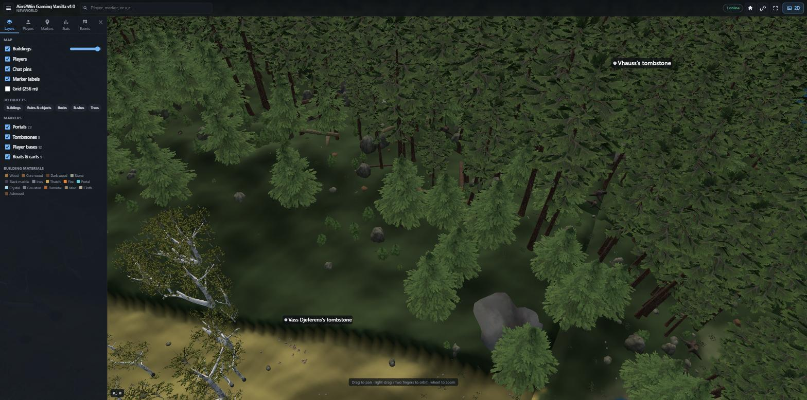
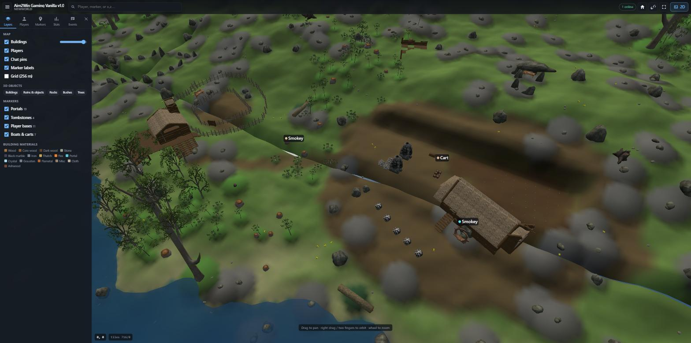
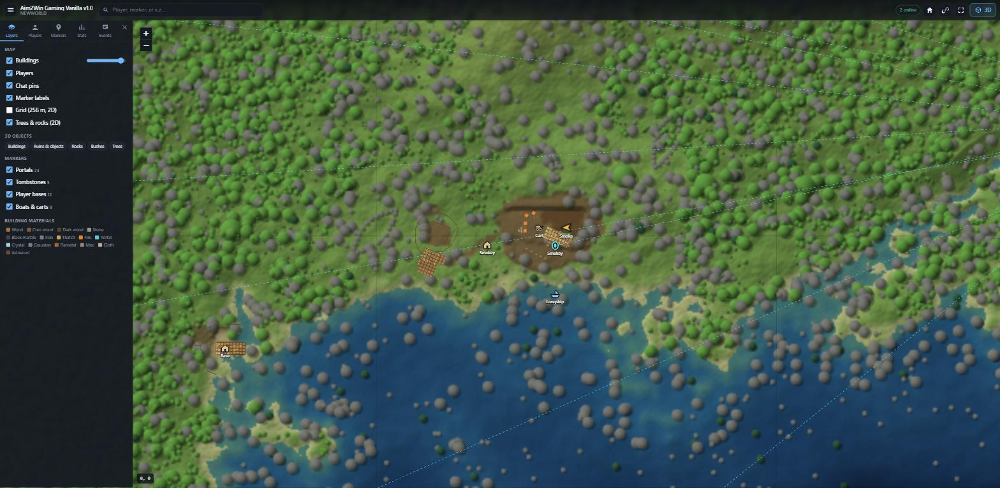
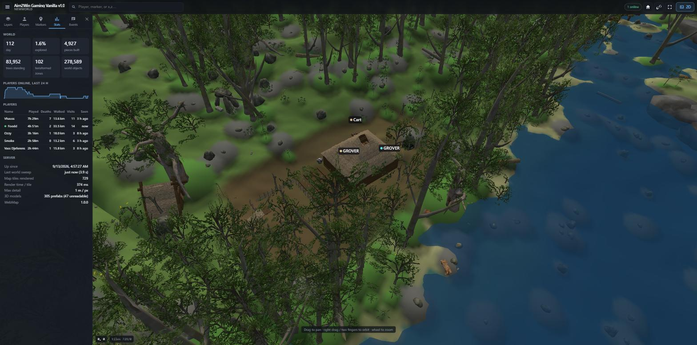

# Valheim WebMap

Server-side mod. Publishes live web map of your Valheim world. Share
`http://your_ip:3000`. Clients need no mods. Dedicated server only.



## Features

* **Tiled map, 1 m per pixel.** Seven zoom levels. Rendered from world
  generator plus player terraforming: flattened bases, moats, roads,
  farmland. Trees, bushes, rocks drawn on top as a separate overlay. Felled
  forest shows as clearing on next render.
* **Buildings.** Every placed piece drawn as footprint in material colour.
  Hover shows what it is.
* **3D view.** One click. Terrain, water, players, markers, and every
  object drawn with game's own model: walls, roofs, portals, ruins, trees,
  rocks, boats. Mod exports each prefab once to glTF on server. Browser
  places instances with exact rotation and scale. Base looks like base.
* **Fog of war.** Unexplored ground is black. No toggle. Close-zoom tiles
  render only where players walked.
* **Live players.** Facing, health, biome, PvP and sleep state, follow mode,
  pings, chat pins. Click a player: card with health, stamina, eitr, gear,
  lifetime stats, in 2D and 3D.
* **Markers.** Portals with tags and links, tombstones, player bases,
  boats, carts, your own `markers.json`. World locations (bosses, dungeons,
  traders) never published. World seed never published. No spoilers.
* **Stats.** Per player: playtime, sessions, deaths, distance, portal
  trips, biomes. Per server: day, explored %, pieces, trees, online history.
* **Event feed.** Joins, leaves, deaths, chat, pings. Logged to
  `events.jsonl`.
* **Export.** Any area as a 3D scene: terrain, water, every building and
  object, tree crowns, markers. One `.glb` for Blender, Godot, Unity, three.js,
  or an Unreal pack with a 16-bit heightmap. See [docs/EXPORT.md](docs/EXPORT.md).
* Permalinks, search, mobile layout, dark UI, Discord webhook,
  `POST /announce`.





## Install

1. Install [BepInEx]. Copy `WebMap` folder to

       <server>/BepInEx/plugins/WebMap

   Folder holds `WebMap.dll`, `websocket-sharp.dll`, `web/`.

   **lloesche/valheim-server (Docker):** with `BEPINEX=true`, BepInEx lives
   at `/opt/valheim/bepinex/BepInEx` (data volume). `/config/bepinex` is
   config only. Plugin goes to `/opt/valheim/bepinex/BepInEx/plugins/WebMap`.
   Easiest: bind-mount host folder there. See `tools/docker-compose.test.yml`.
   Config lands in `<config volume>/bepinex/com.valheimwebmap.server.cfg`.
   Publish port: `-p 3000:3000/tcp`.

2. Start server once. Default config written to `BepInEx/config`.
3. Edit config. Restart. Config read at start only.
4. Open port 3000. Visit `http://your_ip:3000`.

Map data lives in `plugins/WebMap/map_data/<World>/`. Shared model library
in `plugins/WebMap/map_data/models/`. Keep both across updates.

### First start

Server renders overview tiles (zoom 0–5, ~500 tiles, one to two minutes on
one core). Then close-zoom tiles over explored ground. Page works at once:
missing zoomed tiles show coarser tile scaled up, swap in when ready.
Counter bottom-left: rendered / queued.

First start also exports prefab models. ~200 prefabs, under a minute.
Never repeats. Log line: `WebMap: models exported N (readable meshes R, ...)`.

### Textures

Server refuses to read textures. Mod pulls the ones its models need out of
the game's own asset files instead: background thread, low priority, a few
seconds after the first model export. Windows, Linux, Docker, no extra
tools, nothing to install. Takes one to two minutes over ~2 GB of bundles,
once per game version. Log lines:

```
WebMap: extracting 142 textures from the game files in .../valheim_server_Data
WebMap: 139 of 142 textures extracted from 61 files in 74s, 3 not found
WebMap: 180 models to re-export with newly extracted textures
```

Textures are game assets: not in this repo, not in the mod zip, never
redistributed. They only ever live in your `map_data/models/` folder,
written from your own server's files. `use_textures = false` skips all of it
(flat colours). `texture_max_size` caps the PNGs (default 512).

Manual fallback, same job, no dependencies (Python 3 only):

```
python3 tools/extract_textures.py <valheim_server_Data> <plugins>/WebMap/map_data/models
```

### Performance on server

Tile rendering runs on worker thread (`render_threads`, default 1, low
priority). Game thread does only: one sliced walk over world objects every
`sweep_interval` seconds (3,000 objects per frame), 1 Hz player snapshot,
fog updates, model export within `export_ms_per_frame`. PNG encoding uses
own writer, off-thread. No Unity textures for tiles.

If engine refuses terrain sampling off main thread, mod falls back to few
rows per frame on game thread. Slower. Never stalls. `render_threads = 0`
picks that mode.

Disk: full world at 1 m/px is ~6,400 tiles, few hundred MB. Only explored
ground renders at close zoom. Typical world: tens of MB. `max_render_zoom = 6`
halves it twice.

## Config

| Section | Key | Default | What |
|---|---|---|---|
| Render | `render_threads` | 1 | worker threads for tiles (0 = game-thread slicing) |
| Render | `prerender_zoom` | 5 | render whole world up to this zoom on first start |
| Render | `max_render_zoom` | 7 | closest zoom over explored ground (7 = 1 m/px) |
| Render | `height_max_zoom` | 7 | closest zoom for height tiles (3D) |
| Sweep | `sweep_interval` | 120 | seconds between world walks |
| Sweep | `zdos_per_frame` | 3000 | objects inspected per frame during walk |
| Markers | `reveal_all` | false | no fog: whole world shown and published (testing) |
| User | `always_map` | true | lift fog where hidden players walk. Position stays hidden |
| User | `always_visible` | false | ignore players' "hidden" setting |
| User | `show_last_seen_position` | false | offline players' last position in stats |
| Server | `server_port` | 3000 | HTTP port |
| Server | `map_title` | (server name) | page header title |
| Server | `enable_3d` | true | offer 3D view |
| Server | `event_log` | true | append events to `events.jsonl` |
| Server | `legacy_map` | true | build single-image `map.png` once for `/map` |
| Models | `export_models` | true | export prefab meshes to glTF |
| Models | `object_categories` | piece,other,rock,bush,tree | which world objects 3D view gets |
| Models | `use_textures` | true | texture the 3D models (off: flat colours, extractor idle) |
| Models | `texture_max_size` | 256 | longest texture edge in export |
| Models | `export_ms_per_frame` | 6 | game-thread ms per frame for export |
| Texture | `explore_radius` | 100 | metres revealed around player |
| Discord | `discord_webhook`, `discord_invite_url` | | webhook for events |
| Server | `webmap_url`, `max_pins_per_user` | | link shown in game, pin limit |

### Custom markers

Put `markers.json` beside world map data
(`plugins/WebMap/map_data/<world>/markers.json`). Re-read on change.

```json
{ "sets": [
  { "id": "mines", "label": "Mines", "markers": [
    { "x": 2210, "z": 980, "label": "Silver mine", "icon": "mine", "description": "north face" }
  ] }
] }
```

Icons: `pin dot fire mine house cave boss trader dungeon camp village ruin runestone wreck portal tombstone boat cart poi spawn`.

### Export a 3D scene

Download button in the top bar. Pick the area (visible map, or 256 m to
1.5 km around the centre), terrain detail, what to include, format:

* **glTF, instanced.** One node per prefab, `EXT_mesh_gpu_instancing`.
  Small file. Blender, Godot, three.js.
* **glTF, one node per object.** Unreal, Unity, anything without the
  extension. Bigger file, same content.
* **Unreal pack.** Zip: the flat scene, `heightmap_r16.png` for a Landscape,
  `instances.csv` and `markers.csv` in Unreal units, an editor Python
  script, README with the Landscape scale and location numbers.

Built in the browser from what the map already shows, so fog applies:
nothing undiscovered leaves the server. Meshes and textures are the game's
own assets from your server. Use the file yourself, do not redistribute it.
Full steps per editor in [docs/EXPORT.md](docs/EXPORT.md).

## HTTP API

| Path | Returns |
|---|---|
| `/tiles/map/{z}/{x}/{y}.png` | map tile, zoom 0–7. 404 + `X-WebMap-Tile: pending` while rendering |
| `/tiles/height/{z}/{x}/{y}.png` | height tile, [Terrarium] encoding |
| `/data/structures/index.json`, `/data/structures/{cx}_{cz}.json` | pieces per 256 m chunk |
| `/data/veg/{cx}_{cz}.bin` | vegetation points per chunk (`Vegetation.cs`) |
| `/data/objects/index.json`, `/data/objects/{cx}_{cz}.bin` | every placed object per chunk: prefab, position, rotation, scale (`WorldObjects.cs`) |
| `/data/prefabs.json` | model library index: which prefabs have glTF, bounds, triangles, textures |
| `/models/{hash}.glb`, `/models/tex_*.png` | exported models and textures. Cacheable |
| `/data/markers.json` | marker sets |
| `/data/players.json`, `/data/stats.json`, `/data/events.json`, `/data/pins.json` | live state |
| `/data/fog.png` | explored mask, north up |
| `/config`, `/api/status` | config, renderer and sweep status |
| `POST /api/sweep` | run world walk now |
| `POST /api/rerender?zoom=N` | re-render tiles from zoom N up (token) |
| `POST /api/reexport` | re-export every prefab model (token) |
| `POST /announce` | message on every player's screen (token) |
| `/map`, `/map.jpg`, `/fog`, `/players`, `/pins`, `/messages`, `/structures`, `/structures/stats`, `/structures/refresh`, `/forest`, `/forest/stats`, `/vehicles` | simple endpoints: single-image map, plain lists |

Websocket at `/ws`. JSON frames: `hello`, `players`, `events`, `tiles`,
`world`, `ping`, `pin`, `rmpin`, `reload`.

Tile grid: world is 20,480 m square centred on origin. Zoom 7: one pixel is
one metre. Tile (0,0) is north-west corner. Zoom `z` has `2^(7-z)` metres per
pixel. `tx = floor((x + 10240) / (256 · 2^(7-z)))`,
`ty = floor((10240 − z_world) / (256 · 2^(7-z)))`.

### Token

`POST /announce`, `/api/rerender`, `/api/reexport` need shared secret in
header `X-Announce-Token`. Secret read from file `announce.token` beside DLL.
No file: routes closed.

## Chat commands

* `!pin [type] [text]` — types `dot`, `fire`, `mine`, `house`, `cave`
* `!undoPin`, `!deletePin [text]`

## Build

Windows: `.\build.ps1`. Needs .NET SDK and Steam "Valheim Dedicated Server"
tool, or `-ValheimManaged <path>`. Linux/macOS: `./build.sh`. Output:
`dist/ValheimWebMap-<version>.zip` and `dist/pkg/WebMap/`. `-Deploy <plugins dir>`
or `--deploy` copies plugin there.

## Test without production

`tools/mockserver.js` (Node, no dependencies): serves web app with
procedural world, fake players, events. `node tools/mockserver.js`, open
<http://localhost:3000>.

`tools/docker-compose.test.yml`: real dedicated server (lloesche image)
against copy of your world.

```powershell
# copy world folder to valheim-test\config\worlds_local\<World>\
.\build.ps1 -Deploy valheim-test\plugins
docker compose -f tools\docker-compose.test.yml up      # first run downloads server
```

Then <http://localhost:3000>. In game: Join by IP, `127.0.0.1:2456`

Copied world starts with empty fog. Exploration lives in player files, not
world. Map stays black until someone walks. For tests set `reveal_all = true`
in `valheim-test\config\bepinex\com.valheimwebmap.server.cfg`. Restart.
Tiles still render lazily.

## Licence

MIT. See `LICENSE`. Leaflet (BSD-2) and three.js (MIT) vendored under
`web/vendor`.

[BepInEx]: https://github.com/BepInEx/BepInEx
[Terrarium]: https://github.com/tilezen/joerd/blob/master/docs/formats.md#terrarium
